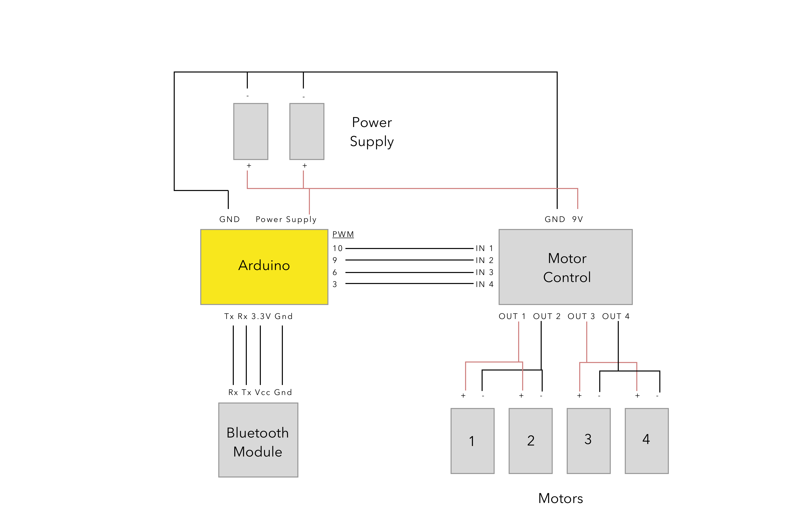
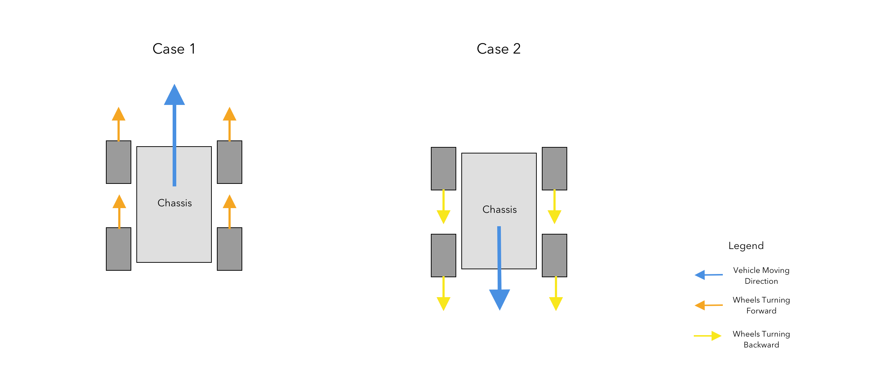
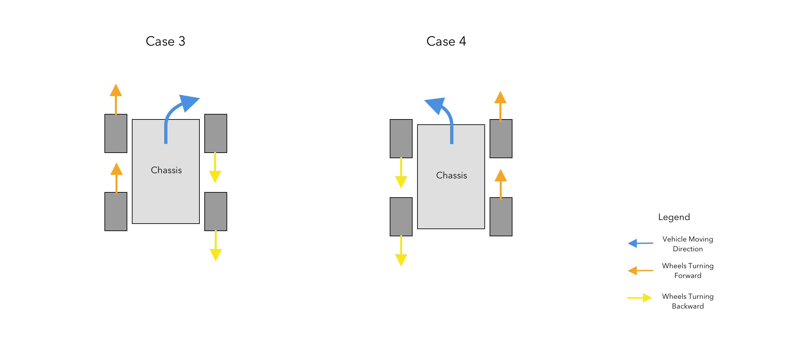

**IMPORTANT:** This project is out of date. I will update this page in late June. Thank you.     


# Bluetooth-Controlled Robot Vehicle

## About This Project
This project can be served as a basic guideline for building robots of any kind. It is simple to build and easy to make further improvement.


## Components
**Car Chassis**

**4 Motors**

**Bread Board**
  * For connecting and organizing all the wires

**Arduino Uno**

**H-Bridge**
  * For this project, L298N Motor Drive Controller Board DC Dual H-Bridge was used
  * For controlling the motors

**9 V Batteries**
  * Power supply for both Arduino and motor system

**Bluetooth Module**
 * For communication and control

## Schematics


Note: The Motor Control Unit is the H-Bridge.

## Design Analysis

The idea for driving the vehicle forward and backward is activating all four wheels in the same direction.


This project uses differential wheels to change direction. The general idea is to make motors spin in different directions. One side wheels spin in a direction while the wheels on the other side spin in an opposite direction. Thus, it produces a rotation on the chassis.

## Further Improvement
One of the most important improvement I will make for this project is the controlling UI on the computer. Right now, the vehicle can only read four commands: forward, backward, turn right, and turn left.

## Code
This is the arduino code with extension .ino
```
int v = 200;

void setup() {
  // initialize serial:
  Serial.begin(9600);
  // initialize the led pin
}

void loop() {
  while (Serial.available()) {
    char inChar = (char)Serial.read();
    switch(inChar) {
      case 'd':
        analogWrite(3,v);
       analogWrite(6,0);
       analogWrite(9,v);
       analogWrite(10,0);
      break;
      case 'a':
        analogWrite(3,0);
        analogWrite(6,v);
        analogWrite(9,0);
        analogWrite(10,v);
      break;
      case 's':
        analogWrite(3,v);
        analogWrite(6,0);
        analogWrite(9,0);
        analogWrite(10,v);
      break;
      case 'w':
        analogWrite(3,0);
        analogWrite(6,v);
        analogWrite(9,v);
        analogWrite(10,0);
      break;
      case '0':
        analogWrite(3,0);
        analogWrite(6,0);
        analogWrite(9,0);
        analogWrite(10,0);
      break;
    }
    Serial.println(inChar);
  }
}
```

## Previous Design Using Joystick
Before implementing with the bluetooth design, I used joystick for wired control. Please see details [here](https://github.com/YiChiMa/robot-car/tree/master/joystick).
