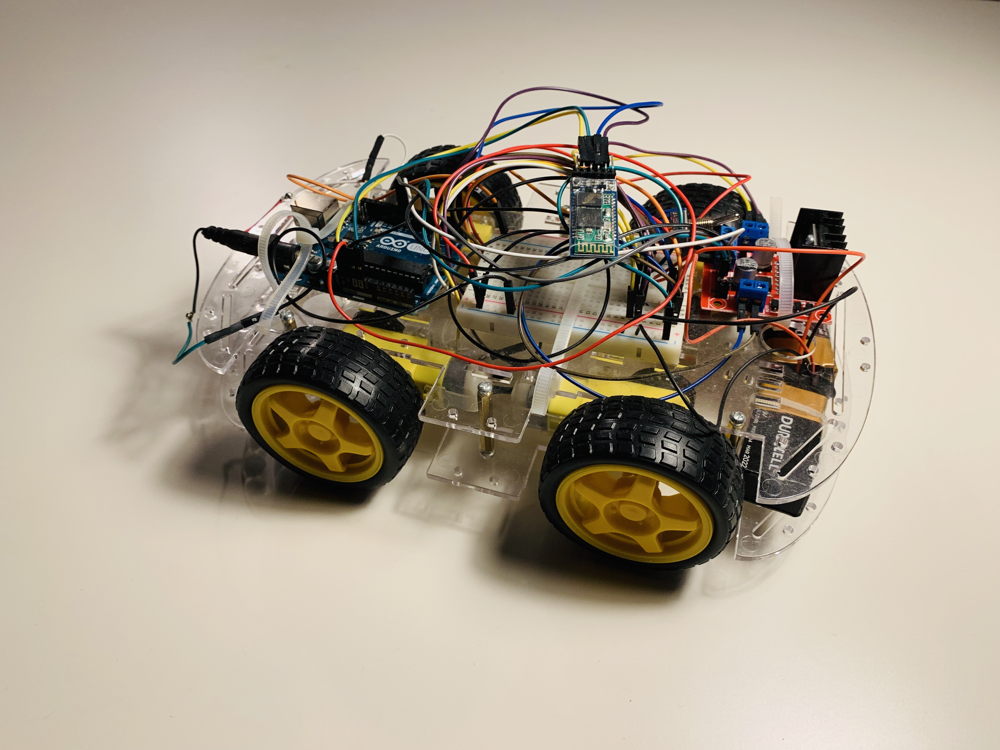
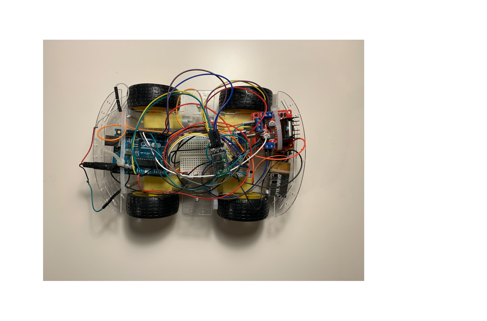

# Bluetooth-Controlled Robot Vehicle

## About This Project
This project can be served as a basic guideline for building robots of any kind. It is simple to build and easy to make further improvement. The fabrication cost is about $60.



## Components
**Car Chassis:**
I brought two acrylic boards and four wheels on Amazon for quick prototyping purposes.

**4 Motors**: Four motors are brushed gear motors with DC 6 - 9 voltage power supply. These motors are standard and simple to control with PWM.

**Bread Board**: Breadboard is used to organize all wires.

**Arduino Uno**: Arduino Uno is used as the microcontroller.

**H-Bridge**: L298N Motor Drive Controller Board DC Dual H-Bridge is used as the intermediate component between the microcontroller and the motors. It allows speed and direction control by reading four PWM signals from the microcontroller.

**9 V Batteries**: Two 9-V Batteries are used for powering the microcontroller and the four motors.

**Bluetooth Module**: Bluetooth module is used to communicate between the microcontroller and the laptop monitor. The microcontroller reads the command received from the bluetooth module.

## Schematics


Note: The Motor Control Unit is the L298N Motor Drive Controller Board.

## Design Analysis

**(Figure 1)**

The idea for driving the vehicle forward and backward is activating all four wheels in the same direction.


**(Figure 2)**

This project uses differential drive to change direction. Motors on two sides can run at a different speed or in the opposite direction. The difference of the wheel’s spinning speed would cause the chassis to turn. If one side wheels spin in a direction while the wheels on the other side spin in an opposite direction, the chassis will spin along the central axis.


**(Top View)**


## Further Improvement
One of the most important improvement I will make for this project is the controlling UI on the computer. Right now, the vehicle can only read four commands: forward, backward, turn right, and turn left.

## Code
This is the Arduino code:
```
int v = 200;

void setup() {
  // initialize serial:
  Serial.begin(9600);
  // initialize the led pin
}

void loop() {
  while (Serial.available()) {
    char inChar = (char)Serial.read();
    switch(inChar) {
      case 'd':
        analogWrite(3,v);
       analogWrite(6,0);
       analogWrite(9,v);
       analogWrite(10,0);
      break;
      case 'a':
        analogWrite(3,0);
        analogWrite(6,v);
        analogWrite(9,0);
        analogWrite(10,v);
      break;
      case 's':
        analogWrite(3,v);
        analogWrite(6,0);
        analogWrite(9,0);
        analogWrite(10,v);
      break;
      case 'w':
        analogWrite(3,0);
        analogWrite(6,v);
        analogWrite(9,v);
        analogWrite(10,0);
      break;
      case '0':
        analogWrite(3,0);
        analogWrite(6,0);
        analogWrite(9,0);
        analogWrite(10,0);
      break;
    }
    Serial.println(inChar);
  }
}
```

## Previous Design Using Joystick
Before implementing with the bluetooth design, I used joystick for wired control. Please see details [here](https://github.com/YiChiMa/robot-car/tree/master/joystick).
